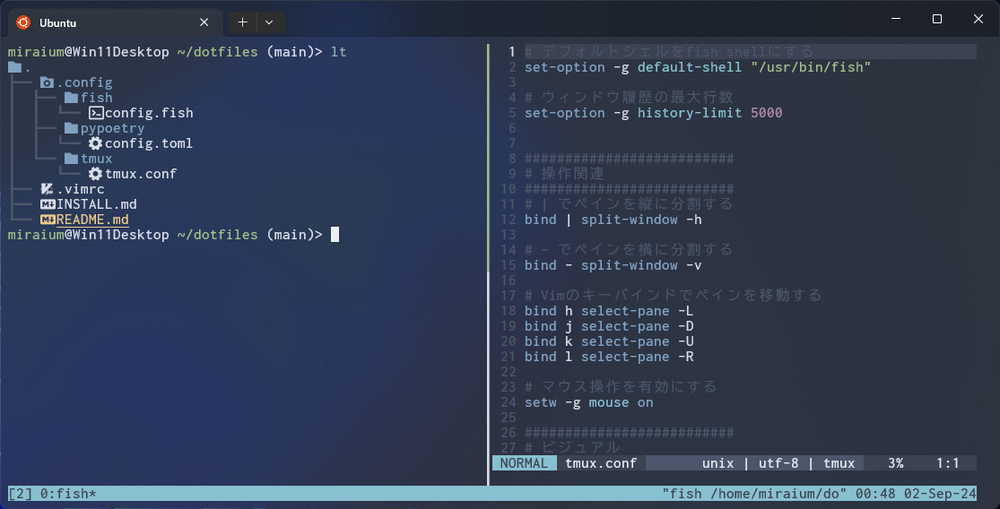

# dotfiles

## 概要

このリポジトリは、私の個人的な設定ファイルを管理するためのものです。  
TmuxとFishを使用したシェル環境を提供します。Nordテーマを採用し、視覚的に快適な作業空間を実現しています。  
さらに、Fishシェル上ではeza、z、fzfといったCLIツールを活用し、作業の生産性を向上させています。  
Python環境の構築にはasdfとpoetryを利用しており、効率的なパッケージ管理が可能です。

## インストール

インストール手順については、[INSTALL.md](INSTALL.md)を参照してください。
このファイルには、必要な依存関係のインストール方法や設定手順が詳しく記載されています。

## ツール一覧と使用方法

以下のツールが含まれており、それぞれの使用方法については公式ドキュメントを参照してください。

- **Vim**: [Vimの使い方](https://www.vim.org/docs.php)
- **tmux**: [tmuxの使い方](https://tmux.github.io/)
- **fish**: [Fishシェルの使い方](https://fishshell.com/docs/current/index.html)
- **z**: [zの使い方](https://github.com/jethrokuan/z)
- **fzf**: [fzfの使い方](https://github.com/junegunn/fzf)
- **eza**: [ezaの使い方](https://eza.rocks/)
- **asdf**: [asdfの使い方](https://asdf-vm.com/)
- **poetry**: [poetryの使い方](https://python-poetry.org/docs/)

## 参考リンク

このdotfilesはWindows Terminalでの使用を想定しています。
Windows Terminalの設定については、以下のリポジトリに公開しています。

https://github.com/Miraium/windows-terminal-setting